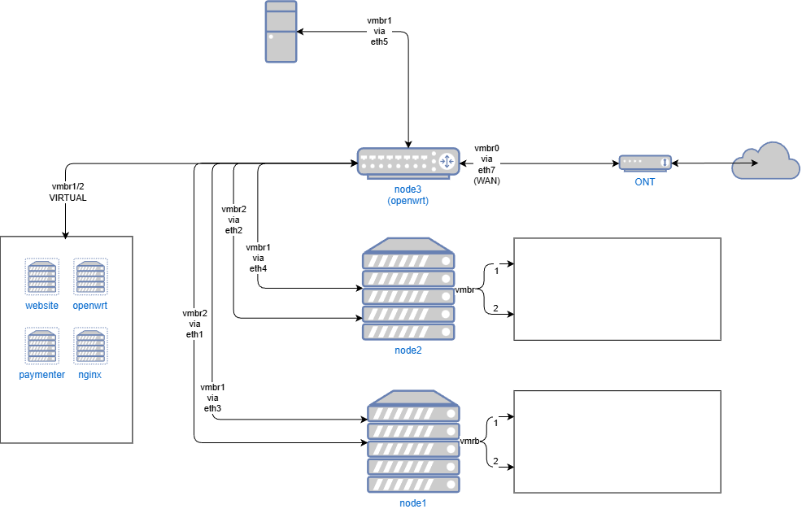

# Network Topology



*Visual representation of the complete network architecture showing WAN, LAN, and DMZ zones with policy-based routing.*

## Problem Statement

The platform needs to expose customer websites to the internet without:
- Simple port forwarding (insecure, not scalable)
- Exposing home IP directly (privacy, DDoS risk)
- Relying on external proxy services (performance, cost)
- Compromising internal network security

Additionally, dynamic home IP presents a challenge for maintaining stable connectivity.

## Solution Architecture

### Three-Layer Network Design

The infrastructure uses three distinct network segments:

1. **WAN Network** (pppoe-wan)
   - PPPoE connection via VLAN 1203 on eth0
   - Dynamic IP from ISP
   - ISP: Fiber connection

2. **LAN Network** (eth1)
   - Subnet: 192.168.1.0/24
   - Gateway: 192.168.1.1 (OpenWrt)
   - Internal services, management interfaces
   - Isolated from public traffic
   - Used for: Proxmox management, Paymenter, internal APIs

3. **DMZ Network** (bridge: eth2 + wg0)
   - Subnet: 203.0.113.0/27 (30 usable IPs)
   - Gateway: 203.0.113.1
   - Bridged between physical interface (eth2) and WireGuard tunnel (wg0)
   - Customer-facing services
   - Used for: Customer containers, NPM, ISPConfig

## Physical Infrastructure

### Router Node (Dedicated Mini PC)

**Hardware:**
- 6x 2.5Gbps RJ45 ports
- Runs Proxmox VE
- Hosts OpenWrt LXC container

**Port Assignment:**
```
eth0: WAN connection (VLAN 1203 to ISP)
eth1: LAN network (192.168.1.0/24)
eth2: DMZ network (bridged with WireGuard)
Remaining ports: Available for expansion
```

### Hosting Nodes (2x Servers)

**Each node has:**
- NIC 1: LAN network (192.168.1.x) for management
- NIC 2: DMZ network (203.0.113.x) for public services

This dual-NIC setup allows:
- Management traffic stays on LAN
- Customer traffic uses DMZ/public IPs
- Complete network isolation

## Virtual Router Configuration

### OpenWrt LXC Container

Running as privileged LXC on router node managing three network zones:

#### Network Interfaces

**eth0.1203 (WAN Interface - VLAN Tagged):**
```
Type: PPPoE over VLAN 1203
Protocol: PPPoE
VLAN ID: 1203
Username: <redacted>
Password: <redacted>
Dynamic IP: Assigned by ISP
MTU: 1500
DNS: 1.1.1.1, 8.8.8.8
```

**eth1 (LAN Interface):**
```
Protocol: Static IP
IP Address: 192.168.1.1/24
DHCP: Enabled for management devices
DNS: 1.1.1.1, 8.8.8.8
```

**dmz (Bridge Interface):**
```
Type: Bridge
Bridged ports: eth2 (physical) + wg0 (WireGuard)
IP Address: 203.0.113.1/27
Protocol: Static
No DHCP: Static IPs only
```

### PPPoE Connection over VLAN

The router uses PPPoE over VLAN 1203 because the ISP requires:
- VLAN tagging for service identification
- PPPoE authentication layer
- Fiber service configuration

**Connection flow:**
```
ISP Fiber → eth0 → VLAN 1203 tag → PPPoE authentication → Internet
```

## WireGuard VPN Tunnel

### The Dynamic IP Challenge

Home ISP provides dynamic IP that changes periodically. Traditional VPN solutions require static endpoint IPs. WireGuard solves this elegantly.

### How WireGuard Handles Dynamic IPs

WireGuard maintains connectivity through:
1. **Endpoint Discovery**: Automatically detects IP changes
2. **Keepalive Packets**: Sends packets every 10 seconds to maintain NAT mappings
3. **Bidirectional Detection**: Either side can initiate connection after IP change
4. **Cryptographic Identity**: Connection verified by public keys, not IPs

**Configuration:**
```
[Interface]
PrivateKey: <redacted>
ListenPort: 51907

[Peer]
PublicKey: <redacted>
Endpoint: <cloud_provider_ip>:51907
PersistentKeepalive: 10
AllowedIPs: 0.0.0.0/0, ::/0
```

**Key details:**
- **PersistentKeepalive: 10** - Sends packet every 10 seconds (more aggressive than typical)
- **AllowedIPs: 0.0.0.0/0** - Routes all traffic through WireGuard
- **Endpoint** - Cloud provider's static endpoint

### Cloud Provider IP Transit

**Service Details:**
- Subnet: 203.0.113.0/27 (30 usable IPs)
- Protocol: WireGuard
- Static endpoint for tunnel termination
- Traffic: Bidirectional (inbound and outbound)

**Why WireGuard was chosen:**
- Native dynamic IP support (no DDNS needed)
- Lightweight and efficient
- Built into Linux kernel (better performance)
- Simple configuration
- Strong encryption (ChaCha20)

### Routing Configuration

**Policy-Based Routing for DMZ:**

The router uses advanced routing tables to ensure DMZ traffic routes through WireGuard:

```bash
# Routing rule: DMZ subnet uses table 100
ip rule from 203.0.113.0/27 lookup 100

# Table 100 routes:
# - Default route via WireGuard
ip route add default dev wg0 table 100

# - LAN route for local access
ip route add 192.168.1.0/24 dev eth1 table 100
```

**Main routing table:**
```bash
# Default route via PPPoE
default via <isp_gateway> dev pppoe-wan

# WireGuard endpoint via PPPoE (to prevent recursion)
<cloud_provider_ip> via <isp_gateway> dev pppoe-wan

# DMZ subnet on bridge
203.0.113.0/27 dev dmz src 203.0.113.1

# LAN subnet
192.168.1.0/24 dev eth1 src 192.168.1.1

# PPPoE gateway
<isp_gateway> dev pppoe-wan src <dynamic_ip>
```

**Key routing decisions:**
- WireGuard endpoint routes via PPPoE to avoid routing loop
- DMZ traffic uses policy routing (table 100) to force WireGuard tunnel
- LAN traffic uses main table and NATs through PPPoE

### DMZ Bridge Architecture

The DMZ network is implemented as a **bridge** between:
1. **eth2** (physical port to hosting nodes)
2. **wg0** (WireGuard tunnel interface)

**Why bridge instead of routing?**
- Hosts on eth2 and WireGuard appear on same Layer 2 network
- Simplifies IP allocation (single subnet: 203.0.113.0/27)
- DMZ hosts can communicate directly without routing
- Public IPs work seamlessly across physical and tunnel

## Firewall Configuration

### Zone Architecture

OpenWrt uses four firewall zones:

**1. WAN Zone (pppoe-wan)**
```
Default policy:
- Input: ACCEPT (for PPPoE, ICMP, etc.)
- Output: ACCEPT
- Forward: ACCEPT
Masquerading: Enabled (NAT for LAN)
MTU Fix: Enabled
```

**2. LAN Zone (eth1)**
```
Default policy:
- Input: ACCEPT
- Output: ACCEPT
- Forward: ACCEPT
Network: 192.168.1.0/24
```

**3. DMZ Zone (bridge: eth2 + wg0)**
```
Default policy:
- Input: ACCEPT
- Output: ACCEPT
- Forward: ACCEPT
MTU Fix: Enabled
```

**4. WireGuard Zone (wg0)**
```
Default policy:
- Input: ACCEPT
- Output: ACCEPT
- Forward: ACCEPT
```

### Zone Forwarding Rules

```
LAN → WAN: Allowed (NAT)
WAN → LAN: Allowed (for established connections)
LAN → DMZ: Allowed
WireGuard → DMZ: Allowed
DMZ → WireGuard: Allowed
```

### Security Rules

**Gateway Protection:**
```
Rule: Drop-GW-Traffic
- Block all traffic to DMZ gateway (203.0.113.1)
- Prevents external access to router's DMZ interface
- Applies to all protocols
```

**WAN Rules:**
- Allow DHCP renew (UDP 68)
- Allow ICMP ping
- Allow IGMP
- Allow DHCPv6 (UDP 546)
- Allow ICMPv6 types
- Allow IPSec ESP
- Allow ISAKMP (UDP 500)

### Default Security Posture

```
Input: REJECT (default deny)
Output: ACCEPT
Forward: REJECT (default deny, explicit allows only)
SYN Flood Protection: Enabled
```

## Traffic Flow Examples

### Customer Accessing Website

```
Customer Browser
    ↓ (HTTPS to 203.0.113.10)
Internet
    ↓
Cloud Provider (receives on public IP)
    ↓ (routes to WireGuard tunnel)
WireGuard Tunnel
    ↓ (encrypted to local endpoint)
OpenWrt Router
    ↓ (decrypts, forwards to DMZ bridge)
DMZ Bridge (eth2)
    ↓ (Layer 2 forwarding)
NPM VM (203.0.113.10)
    ↓ (reverse proxy to backend)
WordPress Container (192.168.1.X via NPM proxy)
    ↓ (response back through same path)
Customer Browser
```

### Internal Management Access

```
Admin Device (192.168.1.50)
    ↓
OpenWrt Router (192.168.1.1)
    ↓ (routes within LAN)
Proxmox Node 1 (192.168.1.10)
```

**Note:** Management traffic never touches DMZ or WireGuard tunnel.

### Outbound Traffic from DMZ Host

```
DMZ Host (203.0.113.10)
    ↓ (default gateway: 203.0.113.1)
OpenWrt Router DMZ Interface
    ↓ (policy routing: table 100)
WireGuard Tunnel (wg0)
    ↓ (encrypted through tunnel)
Cloud Provider
    ↓
Internet
```

**Key point:** DMZ hosts route outbound through WireGuard, not through PPPoE.

## IP Allocation Strategy

### DMZ Subnet (203.0.113.0/27)

```
203.0.113.0/27 = 32 total IPs (30 usable)
- 203.0.113.0: Network address (unusable)
- 203.0.113.1: Gateway (OpenWrt DMZ interface)
- 203.0.113.2-9: Reserved for infrastructure
- 203.0.113.10: NPM VM (reverse proxy)
- 203.0.113.11: ISPConfig Web/FTP
- 203.0.113.12: ISPConfig Mail
- 203.0.113.13: ISPConfig DNS 1 (ns1.nodepoint.eu)
- 203.0.113.14: ISPConfig DNS 2 (ns2.nodepoint.eu)
- 203.0.113.15-29: Available for expansion
- 203.0.113.30: Reserved
- 203.0.113.31: Broadcast (unusable)
```

**Why multiple IPs for ISPConfig:**
1. **Traffic segregation**: Know which service is consuming bandwidth
2. **Service isolation**: Mail server issues don't affect DNS
3. **IP reputation**: Separate IPs for email (deliverability)
4. **Load distribution**: Spread traffic across multiple IPs

### LAN Subnet (192.168.1.0/24)

```
192.168.1.0/24 = 254 usable IPs
- 192.168.1.1: OpenWrt router gateway
- 192.168.1.5: Router node (node3) - also hosts Python API backend on port 8080
- 192.168.1.10-11: Proxmox nodes (node1, node2)
- 192.168.1.56: ISPConfig (management interface)
- 192.168.1.100-253: LXC containers (WordPress sites)
```

## Performance Considerations

### Bandwidth

**Theoretical:**
- PPPoE connection: Varies by ISP plan
- WireGuard overhead: ~5-10% CPU, negligible latency (<1ms)
- Network bottleneck: ISP upload speed

**Practical:**
- Per-customer site: Rarely exceeds 10Mbps
- Aggregate: Can handle 20-30 concurrent sites
- WireGuard performs at line rate on modern hardware

### Latency

Typical request latency:
```
Customer → Cloud Provider: 10-30ms (depending on location)
Cloud Provider → WireGuard → Router: 2-5ms
Router → DMZ Bridge → NPM: <1ms
NPM → LAN Container: <1ms
Total added: ~3-7ms (negligible)
```

### Policy Routing Performance

Policy-based routing adds minimal overhead:
- Routing table lookup: <0.1ms
- No performance impact on throughput
- CPU usage remains low (<10% under load)

## Comparison to Cloud Networking

| Homelab Component | AWS Equivalent | Azure Equivalent |
|-------------------|----------------|------------------|
| LAN (eth1) | Private subnet in VPC | Virtual Network (private) |
| DMZ (bridge) | Public subnet in VPC | Virtual Network (public) |
| OpenWrt router | NAT Gateway / Internet Gateway | NAT Gateway / VNet Gateway |
| WireGuard tunnel | VPN Gateway / Direct Connect | VPN Gateway / ExpressRoute |
| Policy routing (table 100) | Route Tables | Route Tables / UDR |
| Dual-NIC nodes | Multi-subnet EC2 instances | Multi-NIC VMs |
| Firewall zones | Security Groups / NACLs | Network Security Groups |
| DMZ bridge | Transit Gateway | Virtual Network Peering |

## Key Takeaways

1. **VLAN + PPPoE** - Proper ISP integration with service isolation
2. **DMZ bridge architecture** - Elegant Layer 2 solution connecting physical and tunnel
3. **Policy-based routing** - Forces DMZ traffic through WireGuard
4. **Aggressive keepalive** - 10-second intervals ensure tunnel stability
5. **Gateway protection** - DMZ gateway IP is firewalled from external access
6. **Dual routing** - LAN uses PPPoE/NAT, DMZ uses WireGuard tunnel
7. **Production-grade security** - Default deny with explicit allows

This network design demonstrates:
- Advanced routing concepts (policy-based routing)
- VLAN configuration and PPPoE
- Bridging physical and virtual interfaces
- VPN tunneling with dynamic IP handling
- Multi-zone firewall architecture
- Cloud-equivalent design patterns

## Troubleshooting Commands

**Check routing:**
```bash
ip route              # Main routing table
ip route show table 100   # DMZ policy routing table
ip rule list          # Policy routing rules
```

**Check WireGuard:**
```bash
wg show              # WireGuard status
ping <cloud_endpoint>    # Test endpoint reachability
```

**Check interfaces:**
```bash
ip addr              # All interface IPs
brctl show           # Bridge status (dmz)
```

**Check firewall:**
```bash
iptables -L -n -v    # Firewall rules
nft list ruleset     # Nftables rules (if using)
```

---

*This setup demonstrates enterprise-grade networking using open-source software: VLAN tagging, policy routing, bridging, VPN tunneling, and multi-zone firewall - all concepts that directly translate to cloud networking.*
